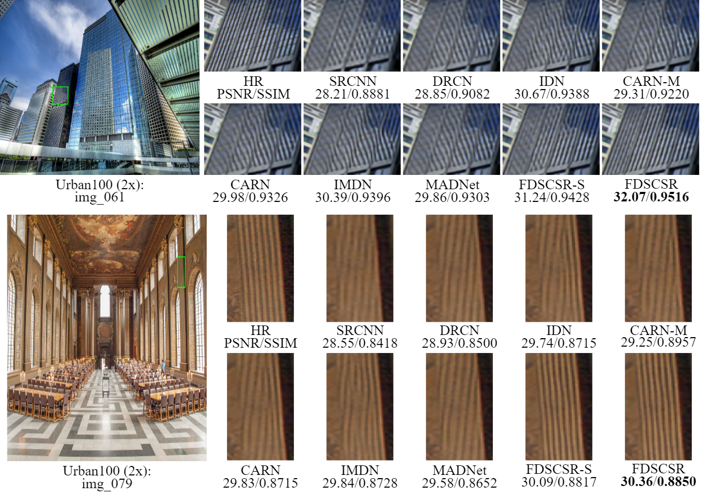
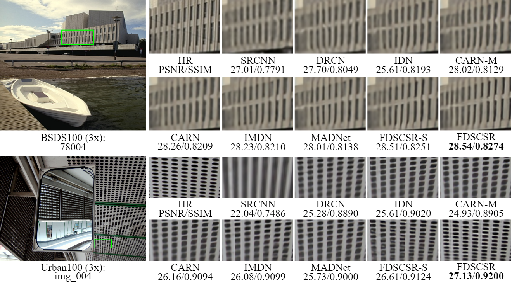

# FDSCSR-Pytorch: Lightweight Feature De-Redundancy and Self-Calibration Network for Efficient Image Super-Resolution

### This repository is an official PyTorch implementation of the paper "Lightweight Feature De-Redundancy and Self-Calibration Network for Efficient Image Super-Resolution".

<a href="">Paper</a>

## Dependencies
```
Python=3.7 
PyTorch = 0.4.0
numpy 
skimage 
imageio 
matplotlib 
tqdm
```

For more informaiton, please refer to <a href="https://github.com/thstkdgus35/EDSR-PyTorch">EDSR</a>

## Dataset

We used DIV2K dataset to train our model. Please download it from <a href="https://data.vision.ee.ethz.ch/cvl/DIV2K/">here</a>  or  <a href="https://cv.snu.ac.kr/research/EDSR/DIV2K.tar">SNU_CVLab</a>.

You can evaluate our models on several widely used [benchmark datasets](https://cv.snu.ac.kr/research/EDSR/benchmark.tar), including Set5, Set14, B100, Urban100, Manga109. 

## Results
All our SR images can be downloaded from <a href="https://pan.baidu.com/s/1ajRh2BNhBJ4iW1n0xJrbnw  ">Results</a>.[百度网盘][提取码:5r7o]

All pretrained model can be found in <a href="https://github.com/wzx0826/FDSCSR/tree/main/Test/model">ACMTOMM2022_FDSCSR</a>.

The following PSNR/SSIMs are evaluated on Matlab R2017a and the code can be referred to <a href="https://github.com/wzx0826/FDSCSR/blob/main/Evaluate_PSNR_SSIM.m">Evaluate_PSNR_SSIM.m</a>.

## Training

1. Specify '--dir_data' based on the HR and LR images path. In option.py, '--ext' is set as 'sep_reset', which first convert .png to .npy. If all the training images (.png) are converted to .npy files, then set '--ext sep' to skip converting files.
2. Cd to 'Train/code', run the following scripts to train models.

```
	
  FDSCSR:

# FDSCSR x4
python main.py --model FDSCSR --save FDSCSR_X4 --scale 4 --n_feats 48  --reset --chop --save_results --patch_size 192

# FDSCSR x3
python main.py --model FDSCSR --save FDSCSR_X3 --scale 3 --n_feats 48  --reset --chop --save_results --patch_size 144

# FDSCSR x2
python main.py --model FDSCSR --save FDSCSR_X2 --scale 2 --n_feats 48  --reset --chop --save_results --patch_size 96

  FDSCSR-S:

# FDSCSR-S x4
python main.py --model FDSCSR --save FDSCSR-S_X4 --scale 4 --n_feats 36  --reset --chop --save_results --patch_size 192

# FDSCSR-S x3
python main.py --model FDSCSR --save FDSCSR-S_X3 --scale 3 --n_feats 36  --reset --chop --save_results --patch_size 144

# FDSCSR-S x2
python main.py --model FDSCSR --save FDSCSR-S_X2 --scale 2 --n_feats 36  --reset --chop --save_results --patch_size 96

```

## Testing

1. Download models for our paper and place them in '/Test/model'.
2. Cd to '/Test/code', run the following scripts.

```
  FDSCSR:

# FDSCSR x4
python main.py --data_test MyImage --scale 4 --model FDSCSR --n_feats 48 --pre_train ../model/FDSCSR_X4.pt --test_only --save_results --chop --save 'FDSCSR_X4' --testpath ../LR/LRBI --testset Set5

# FDSCSR x3
python main.py --data_test MyImage --scale 3 --model FDSCSR --n_feats 48 --pre_train ../model/FDSCSR_X3.pt --test_only --save_results --chop --save 'FDSCSR_X3' --testpath ../LR/LRBI --testset Set5

# FDSCSR x2
python main.py --data_test MyImage --scale 2 --model FDSCSR --n_feats 48 --pre_train ../model/FDSCSR_X2.pt --test_only --save_results --chop --save 'FDSCSR_X2' --testpath ../LR/LRBI --testset Set5

  FDSCSR-S:

# FDSCSR-S x4
python main.py --data_test MyImage --scale 4 --model FDSCSR --n_feats 36 --pre_train ../model/FDSCSR-S_X4.pt --test_only --save_results --chop --save 'FDSCSR-S_X4' --testpath ../LR/LRBI --testset Set5

# FDSCSR-S x3
python main.py --data_test MyImage --scale 3 --model FDSCSR --n_feats 36 --pre_train ../model/FDSCSR-S_X3.pt --test_only --save_results --chop --save 'FDSCSR-S_X3' --testpath ../LR/LRBI --testset Set5

# FDSCSR-S x2
python main.py --data_test MyImage --scale 2 --model FDSCSR --n_feats 36 --pre_train ../model/FDSCSR-S_X2.pt --test_only --save_results --chop --save 'FDSCSR-S_X2' --testpath ../LR/LRBI --testset Set5

```
## Performance

Our FDSCSR is trained on RGB, but as in previous work, we only reported PSNR/SSIM on the Y channel.

Model|Scale|Params|Multi-adds|Set5|Set14|B100|Urban100|Manga109
--|:--:|:--:|:--:|:--:|:--:|:--:|:--:|:--:
FDSCSR-S        |x2|466K|121.8G|38.02/0.9606|33.51/0.9174|32.18/0.8996|32.24/0.9288|38.67/0.9771
FDSCSR          |x2|823K|215.8G|38.12/0.9609|33.69/0.9191|32.24/0.9004|32.50/0.9315|38.89/0.9775
FDSCSR-S        |x3|471K|54.6G|34.42/0.9274|30.37/0.8429|29.10/0.8052|28.20/0.8532|33.55/0.9443
FDSCSR          |x3|830K|96.4G|34.50/0.9281|30.43/0.8442|29.15/0.8068|28.40/0.8576|33.78/0.9460
FDSCSR-S        |x4|478K|31.1G|32.25/0.8959|28.61/0.7821|27.58/0.7367|26.12/0.7866|30.51/0.9087
FDSCSR          |x4|839K|54.8G|32.36/0.8970|28.67/0.7840|27.63/0.7384|26.33/0.7935|30.69/0.9113

## Visual comparison

SR images reconstructed by our FDSCSR have richer detailed textures with better visual effects.
<p align="center">

</p>
<p align="center">

</p>
<p align="center">

</p>

## Model complexity

FDSCSR gains a better trade-off between model size, performance, inference speed, and multi-adds.
<p align="center">


</p>


## Acknowledgements
This code is built on [EDSR (PyTorch)](https://github.com/thstkdgus35/EDSR-PyTorch) and [DRN](https://github.com/guoyongcs/DRN). We thank the authors for sharing their codes.

## Citation

If you use any part of this code in your research, please cite our paper:

```

```
